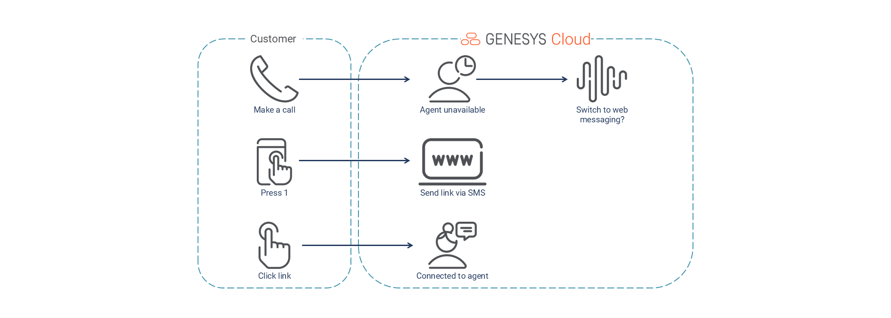

# Switch voice call to a web messaging conversation

This Blueprint consists of a an In-Queue Call Flow that prompts a customer if they’d like to switch to their current voice call in queue to a web messaging conversation. If they accept, the customer is sent an SMS with a message that contains a URL (to a web service that hosts the web messaging widget) along with a query string parameter with the voice call conversation Id. The web service will pull the conversationId from the query string parameter and sets it to the Messenger Database using the Javascript SDK. When the web messaging conversation starts, the Inbound Message Flow reads the conversationId from participant data, and calls a Data Action to first retrieve all the voice call participant data attributes and then a second Data Action to set the new messaging conversation participant data to the attributes pulled from the voice call.

