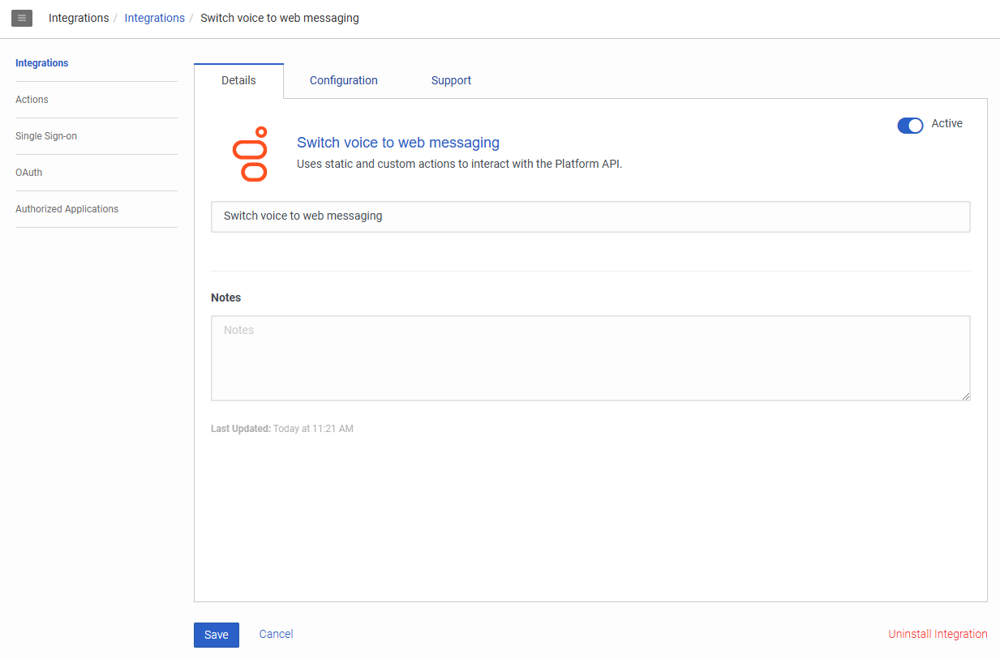
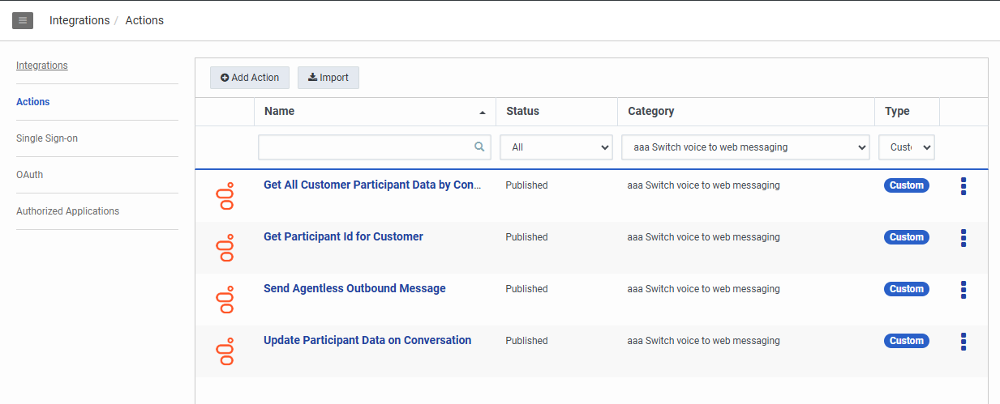

This Blueprint consists of a an In-Queue Call Flow that prompts a customer if they’d like to switch to their current voice call in queue to a web messaging conversation. If they accept, the customer is sent an SMS with a message that contains a URL (to a web service that hosts the web messaging widget) along with a query string parameter with the voice call conversation ID. The web service will pull the conversationId from the query string parameter and sets it to the Messenger Database using the Javascript SDK. When the web messaging conversation starts, the Inbound Message Flow reads the conversationId from participant data, and calls a Data Action to first retrieve all the voice call participant data attributes and then a second Data Action to set the new messaging conversation participant data to the attributes pulled from the voice call.


## Solution components

* **Genesys Cloud** - A suite of Genesys cloud services for enterprise-grade communications, collaboration, and contact center management. Contact center agents use the Genesys Cloud user interface.
* **Genesys Cloud API** - A set of RESTful APIs that enables you to extend and customize your Genesys Cloud environment.
* **Data Action** - Provides the integration point to invoke a third-party REST web service or AWS lambda.
* **Architect flows** - A flow in Architect, a drag and drop web-based design tool, dictates how Genesys Cloud handles inbound or outbound interactions.
* **Web messaging and Messenger** - The Genesys Cloud messaging platform that enables asynchronous conversations and a unified agent and supervisor experience across all Genesys Cloud messaging channels. 

## Prerequisites

### Specialized knowledge

* Administrator-level knowledge of Genesys Cloud
* Expereince with REST API authentication

### Genesys Cloud account

* A Genesys Cloud CX 1 license. For more information, see [Genesys Cloud Pricing](https://www.genesys.com/pricing "Opens the Genesys Cloud pricing article").
* The Master Admin role in Genesys Cloud. For more information, see [Roles and permissions overview](https://help.mypurecloud.com/?p=24360 "Opens the Roles and permissions overview article") in the Genesys Cloud Resource Center.

## Implementation steps

You can implement Genesys Cloud objects manually or with Terraform.
* [Configure Genesys Cloud using Terraform](#configure-genesys-cloud-using-terraform)
* [Configure Genesys Cloud manually](#configure-genesys-cloud-manually)

### Download the repository containing the project files

Clone the [switch-voice-to-web-messaging repository](https://github.com/GenesysCloudBlueprints/switch-voice-to-web-messaging "Goes to the switch-voice-to-web-messaging repository") in GitHub.

## Configure Genesys Cloud using Terraform

### Set up Genesys Cloud

1. Set the following environment variables in a terminal window before you run this project using the Terraform provider:

   * `GENESYSCLOUD_OAUTHCLIENT_ID` - This variable is the Genesys Cloud client credential grant Id that CX as Code executes against. 
   * `GENESYSCLOUD_OAUTHCLIENT_SECRET` - This variable is the Genesys Cloud client credential secret that CX as Code executes against. 
   * `GENESYSCLOUD_REGION` - This variable is the Genesys Cloud region in your organization.

2. Set the environment variables in the folder where Terraform is running. 

### Configure your Terraform build

* `client_id` - The value of your OAuth Client ID using Client Credentials to be used for the data action integration.
* `client_secret`- The value of your OAuth Client secret using Client Credentials to be used for the data action integration.
* `sms_number` - The purchased SMS number with the format `+11234567890`.
* `email` - This value is the email account that you use with Genesys Cloud. It will be used to assign you to the appropriate Genesys Cloud queue.

The following is an example of the dev.auto.tfvars file.

```
client_id       = "your-client-id"
client_secret   = "your-client-secret"
sms_number      = "+11234567890"
email           = "test-email@company.com"
```

### Run Terraform

The blueprint solution is now ready for your organization to use. 

1. Change to the **/terraform** folder and issue the following commands:

   * `terraform init` - This command initializes a working directory containing Terraform configuration files.  
   * `terraform plan` - This command executes a trial run against your Genesys Cloud organization and displays a list of all the Genesys Cloud resources Terraform created. Review this list and make sure that you are comfortable with the plan before you continue to the next step.
   * `terraform apply --auto-approve` - This command creates and deploys the necessary objects in your Genesys Cloud account. The `--auto-approve` flag provides the required approval before the command creates the objects.

After the `terraform apply --auto-approve` command successfully completes, you can see the output of the command's entire run along with the number of objects that Terraform successfully created. Keep the following points in mind:

   * This project assumes that you run this blueprint solution with a local Terraform backing state, which means that the `tfstate` files are created in the same folder where you run the project. Terraform recommends that you use local Terraform backing state files **only** if you run from a desktop or are comfortable deleting files.

   * As long as you keep your local Terraform backing state projects, you can tear down this blueprint solution. To tear down the solution, change to the `docs/terraform` folder and issue the  `terraform destroy --auto-approve` command. This command destroys all objects that the local Terraform backing state currently manages.

### Deploy web messaging to your website

1. [Deploy the snippet to your website](#deploy-the-snippet-to-your-website).
2. Update In-Queue Call Flow to add URL that hosts the web messaging widget in the `Flow.messagingURL`.

## Configure Genesys Cloud manually

### Data Action

You will need to create a Genesys Cloud data action that will be used for sending SMS to switch voice interactions to web messaging. This can be called **Switch Voice to Web Messaging**. 

#### Create an OAuth client for use with a Genesys Cloud data action integration

To enable a Genesys Cloud data action to make public API requests on behalf of your Genesys Cloud organization, use an OAuth client to configure authentication with Genesys Cloud.

Create an OAuth client to use with the data action integration with a custom role.

To create an OAuth Client in Genesys Cloud:

1. Navigate to **Admin** > **Integrations** > **OAuth** and click **Add Client**.

2. Enter a name for the OAuth client and select **Client Credentials** as the grant type. Click the **Roles** tab and assign the required role for the OAuth client.

3. Click **Save**. Copy the client ID and the client secret values for later use.

   **Note:** Ensure that you **copy the client ID and client secret values** for each of the OAuth clients.

#### Add Genesys Cloud data action integration

Add a Genesys Cloud data action integration for each OAuth client being used with this blueprint to call the Genesys Cloud public API to:
* Get All Customer Participant Data by ConversationId
* Get Participant Id for Customer
* Send Agentless Outbound Message
* Update Participant Data on Conversation

To create a data action integration in Genesys Cloud:

1. Navigate to **Admin** > **Integrations** > **Integrations** and install the **Genesys Cloud Data Actions** integration. For more information, see [About the data actions integrations](https://help.mypurecloud.com/?p=209478 "Opens the About the data actions integrations article") in the Genesys Cloud Resource Center.

2. Enter a name for the Genesys Cloud data action, such as **Switch Voice to Web Messaging** in this blueprint solution.

3. On the **Configuration** tab, click **Credentials** and then click **Configure**.

4. Enter the client ID and client secret that you saved for the Public API (OAuth Client 1). Click **OK** and save the data action.

5. Navigate to the Integrations page and set the data action integration to **Active**.

   

#### Import the Genesys Cloud data actions

1. In Genesys Cloud, navigate to **Admin** > **Integrations** > **Actions** and click **Import**.
2. Select the json files and associate with **Switch Voice to Web Messaging** data action integration.
3. Click **Import Action**.
4. Click **Save & Publish**

   

### Web Messaging

#### Messenger Configuration
1. In Genesys Cloud, navigate to **Admin** > **Message** > **Messenger Configurations** and click **New Configuration**.
2. Fill in the configuration based on your needs.
3. Click **Save New Version**.

#### Messenger Deployment
1. In Genesys Cloud, navigate to **Admin** > **Message** > **Messenger Deployments** and click **New Deployment**.
2. In **Select your Configuration**, select the **Messenger Configuration** you made previously.
3. In **Select your Architect Flow**, select the **Switch from Voice Channel with Context**.
4. Click **Save**.

#### Deploy the snippet to your website

After you have created the Genesys Cloud objects, use a Messenger deployment to add a Messenger chat window to your website.

1. Navigate to **Admin** > **Message** > **Messenger Deployments**. Select your Messenger Deployment.
2. Under **Deploy your snippet**, click **Copy to Clipboard** to copy the snippet. Paste the snippet in the `<head>` tag of the web pages where you want the Messenger to appear.

:::primary
For testing purposes, you may use the `mobile-messaging-bot.html` in the [switch-voice-to-web-messaging repo](https://github.com/GenesysCloudBlueprints/switch-voice-to-web-messaging/tree/main/exports).
:::

### Architect 

#### Import the Architect workflows

* The **Switch to Web Messaging via SMS.i3InQueueFlow** In-Queue Call Flow prompts a customer if they’d like to switch to their current voice call in queue to a web messaging conversation. If they accept, the customer is sent an SMS with a message that contains a URL (to a web service that hosts the web messaging widget) along with a query string parameter with the voice call conversation Id.

* If the caller responds for a switch to web messaging, the inbound message flow **Switch from Voice Channel with Context.i3InboundMessage** reads the conversationId from participant data, and calls a Data Action to first retrieve all the voice call participant data attributes and then a second Data Action to set the new messaging conversation participant data to the attributes pulled from the voice call.

#### Import the In-Queue Call Flow

1. Download the `Switch to Web Messaging via SMS.i3InQueueFlow` file from the [switch-voice-to-web-messaging repo](https://github.com/GenesysCloudBlueprints/switch-voice-to-web-messaging/tree/main/exports) GitHub repository.

2. In Genesys Cloud, navigate to **Admin** > **Architect** > **Flows:In-Queue Call Flow** and click **Add**.

3. Enter a name for the In-Queue Call Flow and click **Create Flow**.

4. From the **Save** menu, click **Import**.

5. Select the downloaded **Switch to Web Messaging via SMS.i3InQueueFlow** file and click **Import**.

6. Click the `Initialize SMS variables` step and update the following:
  * `Flow.messagingURL` - URL that hosts the web messaging widget.
  * `Flow.fromAddressForSMS` - Use a purchased SMS number from your org.

7. Click **Save** and then click **Publish**.

#### Import the Inbound Message Flow

1. Download the `Switch from Voice Channel with Context.i3InboundMessage` file from the [switch-voice-to-web-messaging repo](https://github.com/GenesysCloudBlueprints/switch-voice-to-web-messaging/tree/main/exports) GitHub repository.

2. In Genesys Cloud, navigate to **Admin** > **Architect** > **Flows:Inbound Message Flow** and click **Add**.

3. Enter a name for the inbound message flow and click **Create Flow**.

4. From the **Save** menu, click **Import**.

5. Select the downloaded **Switch from Voice Channel with Context.i3InboundMessage** file and click **Import**.

6. Click the `Set default target queue` step and use a queue to accept the Inbound Message interaction.

7. Click **Save** and then click **Publish**.

## Test the solution

1. As a customer, dial the number to route you to the In-Queue Call flow.
:::
Do not set your agent to `On Queue` status.
:::
2. When prompted, press 1 to switch your voice interaction to web messaging.
3. Click on the link to take you to the hosted web application with the hosted web messaging widget.
4. As an agent, toggle to the `On Queue` status and answer the incoming messaging interaction.

## Additional resources

* [Genesys Cloud API Explorer](https://developer.genesys.cloud/devapps/api-explorer "Opens the GC API Explorer") in the Genesys Cloud Developer Center
* The [switch-voice-to-web-messaging](https://github.com/GenesysCloudBlueprints/switch-voice-to-web-messaging) repository in GitHub
